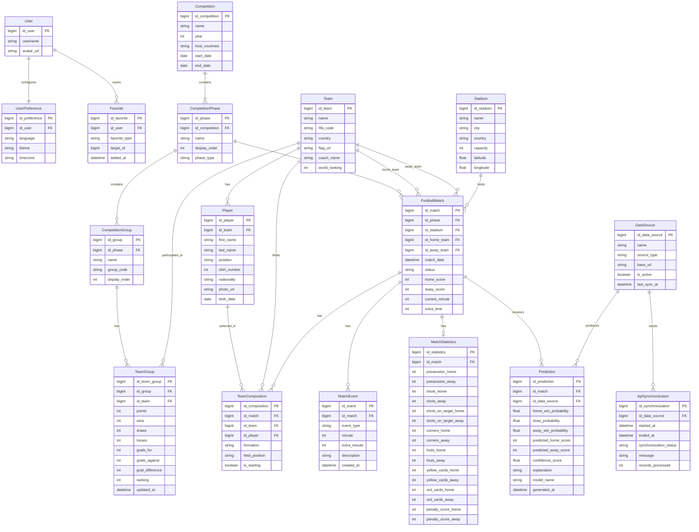

# LiveKick 2026 - Diagramme de donnees

Ce diagramme represente le modele de donnees etendu de LiveKick.

Le perimetre fonctionnel valide pour le MVP reste celui du diagramme de cas
d'utilisation. Les entites supplementaires sont conservees pour permettre une
evolution modulaire de l'application.

## Corrections appliquees

- Conservation de toutes les entites du diagramme transmis.
- Utilisation des noms metier canoniques du projet.
- Utilisation du `snake_case` pour les champs du modele relationnel.
- Suppression du doublon `statut_match` / `status` au profit de `status`.
- Correction des fautes sur les identifiants et scores de tirs au but.
- Distinction explicite des equipes domicile et exterieur d'un match.
- Ajout de la relation entre `Competition` et `CompetitionPhase`.
- Ajout de la source ayant produit une `Prediction`.
- Cardinalite `Team` vers `TeamGroup` rendue compatible avec plusieurs
  competitions ou editions futures.

